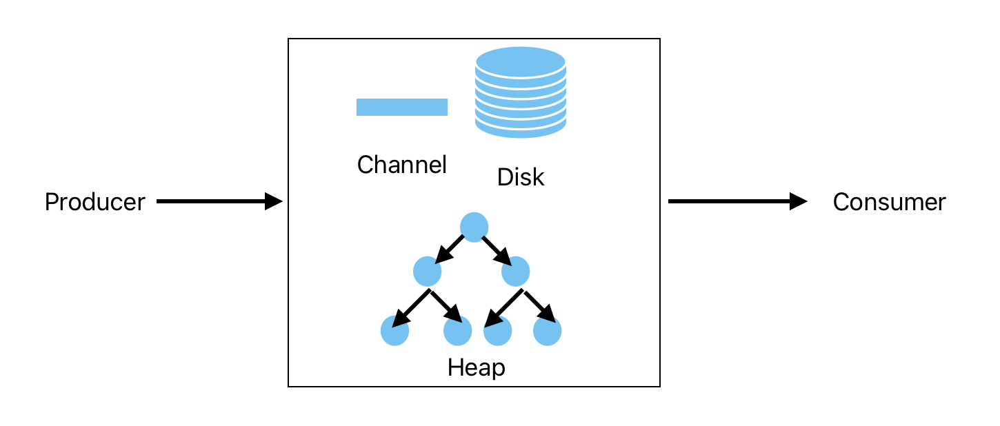
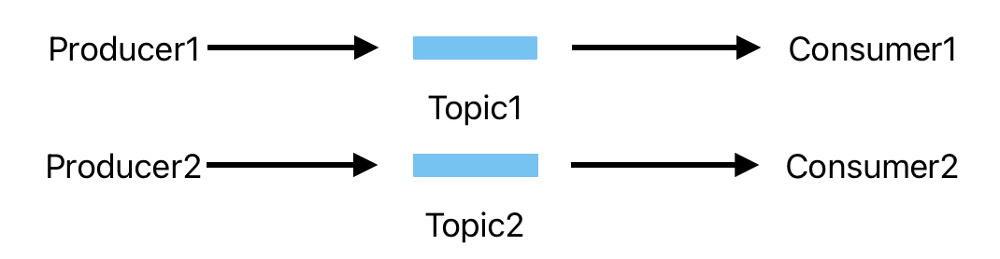
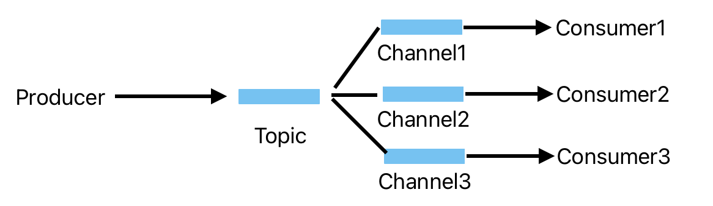

# LTQ

利用golang原生并发实现可用且可靠的消息中间件

## 1.整体架构

- 消息应答ACK+超时重传

  作为消息中间件最重要的需要保证消息的正确从生产者端到消费者端，因此为了防止消息丢失，参考TCP连接的可靠性，采用消息应答ACK+超时重传机制。

  - 在中间件内部使用队列存储所有发送出去的消息，当消费者回复ACK后才会将消息从内部队列删除。如果在超时时间内没有回复，则该条消息会被重新发送。
  - 使用最小堆队列，按照消息到达中间件的时间+设置的超时时间作为优先级存储到队列中，定时从队列中取出堆的根节点，即为最先到达超时的消息发送出去。

- 使用内存作为第一存储，磁盘作为第二存储

  - 使用内存读写速度最快，通过内存提高消息的吞吐量，因此采用channel来存储消息。
  - 但是内存是有限的，当channel的缓冲区已经放满消息后，将后续到达的消息存储到磁盘中，这样保证系统的可用性。

## 2.消息模型

- 1对1模型

  最简单的消息模型就是一个生产者对一个消费者，此时生产者和消费者只需要连接到同一个channel通信即可。

  

- 多对多模型（单个消费者）

  基于主题topic的订阅模式可以让多个生产者的消息传递到订阅了主题的消费者端，此时生产者和消费者需要连接到对应的主题的channel通信。

  

- 多对多模型（多个消费者）

  基于主题的模型中，同一个主题的消费者之间是存在竞争关系，为了保证同一个主题里的所有消费者都能接受到消息，对于同一个topic下增加多条通道，将生产者的消息复制到所有通道里，这样保证所有的消费者都能接收到消息。

  

## 3.生产者消费者的连接

消息传递的连接可以是TCP连接或者HTTP连接。其中TCP连接需要提前建立连接，是长连接，可以持续传输数据。HTTP连接不需要提前建立，按需请求，用于响应式数据的请求。

- 生产者发布数据可以用TCP连接或者HTTP连接。
- 消费者获取消息方式不同，会影响连接的选择。
  - 获取消息可以使用pull：消费者从消息中间件主动拉取消息，这样说按需拉取，但是可能存在空拉的情况，实时性差。
  - 因此选择push方式，这样实时性好，通过消息中间件来推送消息给消费者，只要有对应的主题的消息就会主动推送。但是需要与消费者提前协商推送消息的数量，防止太多的消息使得消费者过载导致系统崩溃。
  - 综上，消费者获取消息采用TCP的长连接，这样可以方便中间件持续push数据。

为了统一接口的处理，生产者和消费者都统一采用TCP连接。

- 生产者发布消息的适合需要指定对于消息的主题，这时候会随机选择一个节点建立TCP连接，往节点发送消息。因此多个主题的消息可能存在多个节点上。
- 消费者获取消息的时候需要与所有主题和channel的节点建立TCP连接，获取所有的消息。

## 4.分布式

- CAP原理
  - 作为消息中间件，最重要的是要消除单点故障，因此是需要实现分布式架构。分布式系统需要满足CAP（一致性，可用性，分区容错性）原理中的两个特性。
  - 由于生产者发布消息是随机选择一个节点，因此整体架构中各个节点上互相独立，互不影响的，数据也并不会做同步。因此不满足一致性，但是满足可用性和分区容错性。这样可扩展性强。

- 服务发现

  由于节点可能增加或者减少，这样生产者和消费者需要不断修改节点地址的列表，因此加入服务发现机制。

  - 服务发现：采用客户端发现模式，服务发现端维护所有可用节点的信息，与节点建立心跳机制，定期检查节点的状态。
  - 节点：如果有新增节点，需要把信息注册到服务发现端。当节点的主题或者channel有变化时，需要更新服务发现端的信息。
  - 生产者：定期去服务发现端查询要发布的topic对应的节点列表，每次都从列表中随机选择一个地址发送数据。
  - 消费者：定期去服务发现端查询要订阅的topic和channel对应的节点列表，每次都与列表中所有地址建立连接，获取数据。

## 5.消息的顺序性

由于生产者是随机选择节点发布消息，在同一个节点上的消息是按照接收的时间有序发送出去的，但是由于同一个主题存在与多个节点上，当消费者接收到消息可能不是按照消息发送的顺序。

为了解决消息的顺序性，提供order的参数给生产者。当这个消息需要按照顺序发送出去时，只会返回存在这个主题的节点地址给生产者，这样消息只会发送到一个节点上，这样消息发送即有序。

## 6.特性

这是一个可用且可靠的消息中间件。

- 可靠：通过消费者端应答+超时重传机制实现。
- 可用：内存+磁盘存储消息保证了系统的吞吐量和可用。
- 性能：CSP模型，golang原生的协程并发+channel传送数据，同时使用内存发送消息性能更高
  - 当有多个请求需要发布消息时，存在并发问题。采用原子操作和加读写锁，提高对共享数据读写效率。
    - 对于简单变量，使用原子操作。原子操作是CPU层级的操作，比直接加锁相比，不需要切换上下文。
    - 对于复杂结构，使用读写锁。对于加读写锁，当读操作时不会阻塞其他协程的读，比直接加锁更好。
  - 使用sync.pool减少GC的压力。消息存放到磁盘中，需要转换为buffer，此时需要创建局部的buffer变量，将局部变量放到pool中，不会导致频繁的创建和销毁对象。